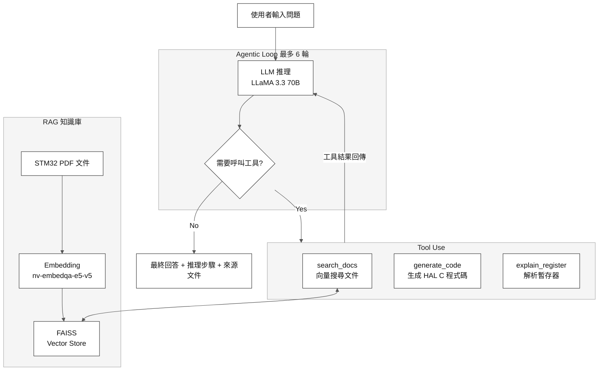

#  STM32 Agentic AI Assistant

一個基於 **RAG + Agentic Loop + Tool Use** 的 STM32 嵌入式系統 AI 助手，能夠自動查詢技術文件、解釋暫存器、生成 HAL C 程式碼。

---

##  專案簡介

本專案是一個 **Agentic AI** 系統，核心概念是讓 LLM 自主決定要呼叫哪些工具、呼叫幾次，而不是由程式硬編碼執行順序。

使用者只需輸入自然語言問題，Agent 會自動：
1. **搜尋文件** — 從 STM32 Reference Manual 找到相關內容
2. **解釋暫存器** — 分析 bit-field 的功能與設定方式
3. **生成程式碼** — 產生可用的 STM32 HAL C 程式碼
4. **整合回答** — 彙整所有工具結果給出完整解答

---

##  系統架構



---

##  核心概念

### 1. RAG（Retrieval Augmented Generation）
- 將 STM32 PDF 文件切割成 chunks 並向量化
- 使用 **FAISS** 進行相似度搜尋
- Embedding 模型：`nvidia/nv-embedqa-e5-v5`

### 2. Tool Use / Function Calling
- LLM 透過 OpenAI function calling 標準格式選擇工具
- 三個工具：`search_docs`、`generate_code`、`explain_register`
- LLM 自主決定呼叫順序與次數

### 3. Agentic Loop
- 最多 6 輪迭代
- 每輪 LLM 決定是否繼續呼叫工具或給出最終答案
- 包含 fallback 機制處理非標準輸出

---

##  技術棧

| 類別 | 技術 |
|------|------|
| LLM | LLaMA 3.3 70B (via NVIDIA API) |
| Embedding | nvidia/nv-embedqa-e5-v5 |
| Vector DB | FAISS |
| PDF 解析 | PyMuPDF + LangChain |
| UI | Streamlit |
| 語言 | Python 3.11+ |

---

##  專案結構

```
stm32-ai-assistant/
├── src/
│   ├── agent.py        # Agentic loop + function calling
│   ├── tools.py        # 工具函式 + TOOLS_SCHEMA
│   ├── ingest.py       # PDF 向量化（建立 vector store）
│   └── ask.py          # 單次問答 CLI（簡易版）
├── data/               # 放 STM32 PDF 文件（不上傳）
├── vector_store/       # FAISS index（不上傳）
├── app.py              # Streamlit 主介面
├── requirements.txt
├── .env.example
└── README.md
```

---

##  安裝與執行

### 1. 安裝依賴

```bash
pip install -r requirements.txt
```

### 2. 設定環境變數

複製 `.env.example` 為 `.env` 並填入 API key：

```bash
cp .env.example .env
```

```env
NVIDIA_API_KEY=your_nvidia_api_key_here
```

> NVIDIA API key 可在 [build.nvidia.com](https://build.nvidia.com) 免費申請

### 3. 放入 PDF 文件

將 STM32 Reference Manual / Datasheet PDF 放入 `data/` 資料夾。

### 4. 建立向量資料庫

```bash
python -m src.ingest
```

只需執行一次，完成後會在 `vector_store/` 產生索引檔案。

### 5. 啟動應用程式

```bash
streamlit run app.py
```

開啟瀏覽器前往 `http://localhost:8501`

---

##  使用範例

**問題：** `How do I configure UART2 at 115200 baud on STM32F103?`

**Agent 執行流程：**

```
 開始處理：目標晶片 STM32F103
 第 1 輪推理
   LLM 推理：決定呼叫 search_docs
   呼叫工具：search_docs({"query": "UART2 baud rate configuration STM32F103"})
   搜尋結果：找到 5 筆相關文件片段
 第 2 輪推理
   LLM 推理：決定呼叫 generate_code
   呼叫工具：generate_code({"description": "Configure UART2 at 115200 baud"})
   生成程式碼完成
 第 3 輪推理
   LLM 決定直接回答
 完成：共執行 3 輪，引用 5 筆來源文件
```

---

##  支援的 STM32 型號

- STM32F103
- STM32F401 / F407
- STM32L4
- STM32H7
- STM32F0 / F3

---

##  未來改進方向

- [ ] 新增更多工具（`list_peripherals`、`check_clock_config`）
- [ ] 支援多份 PDF 來源標記
- [ ] 加入對話記憶長期儲存
- [ ] 部署至雲端（Streamlit Cloud / Hugging Face Spaces）

---

##  作者

專案為嵌入式系統 AI 助手課程作業，展示 Agentic AI 在工程領域的實際應用。
